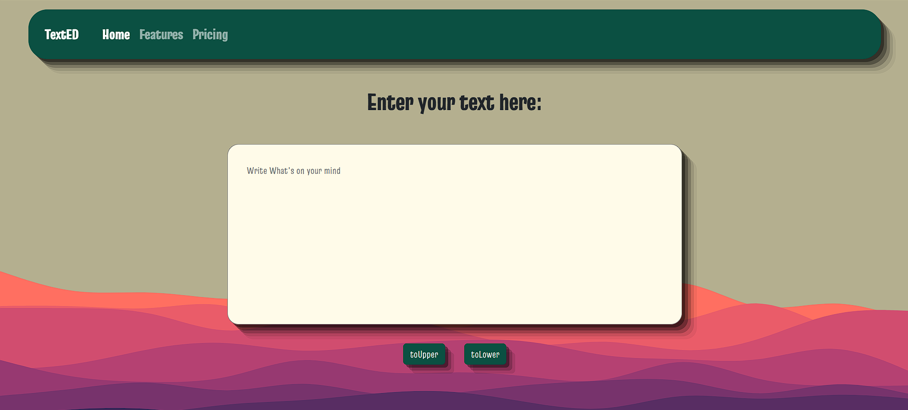

# TextED ✍️

A simple React application where users can type text and **convert it to Uppercase or Lowercase** with a button click!

It looks like you've listed the features of your app, but there’s a small **repetition** in the text. The **"Convert text to Lowercase"** is mentioned **three times**. Here's a corrected version:

---

## 🛠 Features
- Convert text to **Uppercase**
- Convert text to **Lowercase**
- Capitalise the first letter of each sentence
- Capitalise the first letter after "."

---

## 📂 Project Structure
```
/src
 ├── App.jsx
 ├── assets/
 │    ├── Navbar.jsx
 │    ├── Heading.jsx
 │    └── Form.jsx
 │         └── Button.jsx
 ├── App.css
```

## 🚀 How to Run Locally
1. Clone the repository:
   ```bash
   git clone https://github.com/Dipan46/TextED.git
   ```
2. Go to project directory:
   ```bash
   cd TextED
   ```
3. Install dependencies:
   ```bash
   npm install
   ```
4. Start the development server:
   ```bash
   npm run dev
   ```
5. Open `http://localhost:5173` in your browser!

## 🧩 Built With
- React.js
- Vite (optional, if you're using it)
- HTML5, CSS3

## 📸 Preview



> Example UI of the app in action

## 🧑‍💻 Author

Made with ❤️ by [Dipan46](https://github.com/Dipan46)

## 📄 License

This project is open-source and available under the [MIT License](LICENSE).
For major changes, please open an issue first to discuss what you would like to change.
